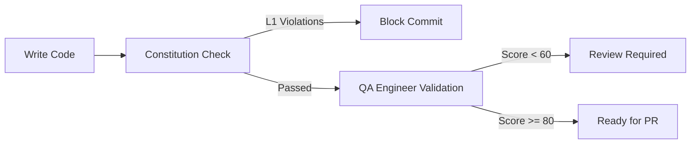

# 🔍 Constitution vs AI-Orchestrator QA: Deep Comparison

> **Analysis Date**: 2026-02-09
> **Comparing**:
> - The Startup Constitution System (`~/.claude/plugins/cache/the-startup/`)
> - AI-Orchestrator QA Engineer (`ai-tools/ai-orchestrator/agents/qa_engineer.py`)

---

## 📊 Executive Summary

### What They Share
Both systems perform **code quality validation**, but at **different stages** and with **different philosophies**:

| Aspect | Constitution | AI-Orchestrator QA |
|--------|-------------|-------------------|
| **When** | During implementation (preventive) | After code generation (reactive) |
| **How** | Pattern matching + LLM checks | Static analysis + test execution |
| **What** | Rule violations | Build + test + quality metrics |
| **Output** | Violation reports | Quality score (0-100) |
| **Philosophy** | "Don't write bad code" | "Verify code works" |

### Key Insight
**They're complementary, not competitive!**
- **Constitution**: Prevents issues during writing
- **QA Engineer**: Catches issues after writing

---

## 🎯 Detailed Feature Comparison

### 1. Security Validation

#### Constitution Approach
```yaml
### No Hardcoded Secrets
level: L1
pattern: "(api_key|apikey|secret|password|token|credential)\\s*[:=]\\s*['\"][^'\"]{8,}['\"]"
scope: "**/*.{ts,js,json,yaml,yml}"
exclude: "**/*.test.*, **/*.spec.*, **/*.example.*, .env.example"
message: Hardcoded secret detected. Use environment variables.
```

**Pros:**
- ✅ Real-time detection during writing
- ✅ Regex-based = fast and deterministic
- ✅ Prevents commit of secrets
- ✅ Works with L1/L2/L3 severity system

**Cons:**
- ❌ Limited to pattern matching
- ❌ Can't detect complex security issues
- ❌ No runtime validation

#### AI-Orchestrator QA Approach
```python
# Part of Security Agent (security_agent.py)
def _scan_owasp_mobile_top_10(self, files):
    # M2: Insecure Data Storage
    # M3: Insecure Communication
    # M4: Insecure Authentication
    # M5: Insufficient Cryptography
    # ... checks for ALL 10 categories

    return {
        "risk_score": 0-100,
        "security_grade": "A-F",
        "findings": [...],
        "remediation": [...]
    }
```

**Pros:**
- ✅ Comprehensive OWASP Mobile Top 10 scanning
- ✅ iOS-specific security (Keychain, certificate pinning)
- ✅ Risk scoring and grading
- ✅ Remediation recommendations

**Cons:**
- ❌ Runs after code is written
- ❌ Can't prevent writing insecure code
- ❌ Separate agent execution required

---

### 2. Architecture Enforcement

#### Constitution Approach
```yaml
### Repository Pattern Required
level: L1
check: Database queries only in files matching *Repository.ts or *Repository.js
scope: "src/**/*.{ts,js}"
exclude: "**/repositories/**"
message: Direct database call outside repository layer.

### No Barrel Exports
level: L1
pattern: "export \\* from"
scope: "src/**/*.ts"
exclude: "src/index.ts"
message: Barrel exports prohibited. Import from specific files.
```

**Pros:**
- ✅ Enforces architectural patterns during development
- ✅ LLM can interpret semantic rules ("database queries only in...")
- ✅ Prevents violations from being written
- ✅ Level system allows flexibility (L1 = must, L3 = should)

**Cons:**
- ❌ LLM interpretation = non-deterministic
- ❌ Can't validate across multiple files
- ❌ Limited to single-file context

#### AI-Orchestrator QA Approach
```python
def _validate_architecture_compliance(self, context, generated_files):
    """Validates against TradeMe iOS architecture patterns."""

    compliance = {
        "triple_module_pattern": self._check_triple_module_pattern(files),
        "dependencies_framework": self._check_dependencies_usage(files),
        "platform_services": self._check_platform_service_access(files),
        "module_hierarchy": self._check_module_hierarchy_constraints(files),
        "universal_api_compliance": self._check_universal_api_patterns(files),
        "reactive_programming": self._check_reactive_bridges(files),
        "passed": all_checks_passed
    }

    return compliance
```

**Pros:**
- ✅ Multi-file architectural validation
- ✅ TradeMe-specific patterns (triple module, Universal API)
- ✅ Comprehensive compliance checks
- ✅ Can analyze complex relationships

**Cons:**
- ❌ Post-generation validation only
- ❌ Can't prevent bad architecture being generated
- ❌ TradeMe iOS-specific (not generalizable)

---

### 3. Code Quality Checks

#### Constitution Approach
```yaml
### No Console Statements in Production
level: L2
pattern: "console\\.(log|debug|info)"
scope: "src/**/*.{ts,js}"
exclude: "**/*.test.*, **/*.spec.*, src/utils/logger.ts"
message: Remove console statements. Use logger utility.

### Functions Under 25 Lines
level: L3
check: Functions should not exceed 25 lines
scope: "src/**/*.{ts,js}"
message: Function too long. Consider extracting into smaller functions.

### No Magic Numbers
level: L3
pattern: "[^0-9]\\b[2-9]\\d{2,}\\b(?![0-9])"
scope: "src/**/*.{ts,js}"
exclude: "**/*.test.*, **/*.spec.*, **/constants/**"
message: Magic number detected. Consider extracting to named constant.
```

**Pros:**
- ✅ Simple, clear rules
- ✅ Easy to understand violations
- ✅ Fast pattern matching
- ✅ L3 = advisory (won't block)

**Cons:**
- ❌ Limited scope per rule
- ❌ Can't analyze code semantics
- ❌ False positives on edge cases

#### AI-Orchestrator QA Approach
```python
def _run_code_quality_checks(self, context, generated_files):
    """Comprehensive code quality analysis."""

    quality = {
        "documentation_coverage": self._check_documentation(files),
        "code_complexity": self._analyze_complexity(files),
        "naming_conventions": self._validate_naming(files),
        "swift_patterns": self._check_swift_best_practices(files),
        "test_coverage": self._analyze_test_coverage(files),
        "performance_indicators": self._check_performance_patterns(files)
    }

    return quality
```

**Pros:**
- ✅ Deep semantic analysis
- ✅ Multi-dimensional quality scoring
- ✅ Swift-specific best practices
- ✅ Test coverage analysis

**Cons:**
- ❌ Post-generation only
- ❌ Can't guide developer during writing
- ❌ More computationally expensive

---

### 4. Testing Validation

#### Constitution Approach
```yaml
### No .only in Committed Tests
level: L1
pattern: "\\.(only|skip)\\s*\\("
scope: "**/*.test.*, **/*.spec.*"
message: Remove .only/.skip before committing tests.

### No console.log in Tests
level: L2
pattern: "console\\.log"
scope: "**/*.test.ts, **/*.spec.ts"
message: Use assertions instead of console.log in tests.

### Test File Recommended
level: L3
check: Every file in src/ should have corresponding .test.ts or .spec.ts
scope: "src/**/*.ts"
exclude: "src/**/*.d.ts, src/**/index.ts"
message: Missing test file for this module.
```

**Pros:**
- ✅ Prevents committing bad test practices
- ✅ Encourages test coverage (L3)
- ✅ Fast checks during development

**Cons:**
- ❌ Can't validate test quality
- ❌ Can't run actual tests
- ❌ Limited to static patterns

#### AI-Orchestrator QA Approach
```python
def _run_unit_tests(self, context, generated_files):
    """Executes actual tests and validates results."""

    test_results = {
        "unit_tests": self._execute_swift_tests(files),
        "ios_ui_tests": self._run_ios_simulator_tests(files),
        "web_tests": self._run_playwright_tests(files),
        "integration_tests": self._run_integration_tests(files),
        "test_coverage": self._calculate_coverage(files),
        "passing_rate": pass_count / total_count,
        "failed_tests": [...],
        "auto_fix_attempts": [...]  # From test_runner.py
    }

    return test_results
```

**Pros:**
- ✅ **ACTUALLY RUNS THE TESTS** 🎯
- ✅ iOS Simulator MCP integration
- ✅ Playwright MCP for web testing
- ✅ Auto-fix retry loop (up to 3 attempts)
- ✅ Coverage analysis

**Cons:**
- ❌ Requires test execution environment
- ❌ Slower than static checks
- ❌ Post-generation only

---

### 5. React/Framework-Specific Rules

#### Constitution Approach
```yaml
### No Direct State Mutation
level: L1
pattern: "this\\.state\\.[a-zA-Z]+\\s*="
scope: "src/**/*.{tsx,jsx}"
message: Use setState instead of direct state mutation.

### Key Prop Required in Lists
level: L2
check: Array.map rendering JSX must include key prop with unique value
scope: "src/**/*.{tsx,jsx}"
message: Missing or invalid key prop in list rendering.

### No useEffect Dependencies Warning
level: L2
check: useEffect hooks should have explicit dependency arrays
scope: "src/**/*.{tsx,jsx}"
message: useEffect without dependency array runs on every render.
```

**Pros:**
- ✅ React-specific patterns
- ✅ Prevents common React bugs
- ✅ During-development feedback

**Cons:**
- ❌ React/JavaScript only
- ❌ Can't analyze component behavior

#### AI-Orchestrator QA (Swift/iOS)
```python
# No direct equivalent - this is iOS/Swift-focused
# But has equivalent Swift-specific checks:

def _validate_swift_patterns(self, files):
    """Validates Swift and iOS best practices."""

    patterns = {
        "memory_management": self._check_retain_cycles(files),
        "thread_safety": self._check_main_thread_access(files),
        "optional_handling": self._check_optional_unwrapping(files),
        "protocol_conformance": self._check_protocols(files),
        "combine_patterns": self._check_reactive_patterns(files)
    }

    return patterns
```

**Key Difference:**
- Constitution: **JavaScript/TypeScript/React**
- QA Engineer: **Swift/iOS/TradeMe patterns**

---

## 🎨 What You Can Bring In

### 1. ⭐ **Code Review Workflow Pattern** (HIGHLY RECOMMENDED)

The QA Engineer's validation workflow is **exactly what Constitution needs** for execution:

```python
# From qa_engineer.py - lines 58-115
def run_quality_assurance(self, context: WorkflowContext):
    # 1. Get generated files
    generated_files = self._get_generated_files(context)

    # 2. Run build validation
    build_validation = self._run_build_validation(context, generated_files)

    # 3. Run unit tests
    test_results = self._run_unit_tests(context, generated_files)

    # 4. Validate architecture compliance
    architecture_compliance = self._validate_architecture_compliance(...)

    # 5. Run code quality checks
    code_quality = self._run_code_quality_checks(...)

    # 6. Performance benchmarking
    performance_metrics = self._run_performance_tests(...)

    # 7. Integration testing
    integration_tests = self._run_integration_tests(...)

    # 8. Calculate overall score
    overall_score = self._calculate_overall_score(...)

    # 9. Generate recommendations
    recommendations = self._generate_recommendations(...)

    # 10. Identify critical issues
    critical_issues = self._identify_critical_issues(...)
```

**How to adapt for Constitution:**

Create a **`/start:validate constitution`** workflow:

```markdown
# Constitution Validation Workflow

## Phase 1: Pattern Rule Validation
- Run regex-based checks (L1/L2)
- Fast, deterministic scanning
- Output: Pattern violations

## Phase 2: Semantic Rule Validation
- LLM-based "check" rules (L1/L2)
- Architectural patterns
- Output: Semantic violations

## Phase 3: Advisory Checks
- L3 recommendations
- Code quality suggestions
- Output: Improvement suggestions

## Phase 4: Score & Report
- Calculate overall score (0-100)
- Generate recommendations
- Identify critical blockers (L1 violations)
```

---

### 2. ⭐ **Multi-Dimensional Scoring System** (RECOMMENDED)

```python
def _calculate_overall_score(
    self,
    build_validation,
    test_results,
    architecture_compliance,
    code_quality,
    performance_metrics,
    integration_tests
):
    """Calculate weighted quality score."""

    weights = {
        "build": 0.20,           # 20% - Must compile
        "tests": 0.25,           # 25% - Tests must pass
        "architecture": 0.20,    # 20% - Must follow patterns
        "quality": 0.15,         # 15% - Code quality
        "performance": 0.10,     # 10% - Performance acceptable
        "integration": 0.10      # 10% - Integrates properly
    }

    score = (
        weights["build"] * self._score_build(build_validation) +
        weights["tests"] * self._score_tests(test_results) +
        weights["architecture"] * self._score_architecture(architecture_compliance) +
        weights["quality"] * self._score_quality(code_quality) +
        weights["performance"] * self._score_performance(performance_metrics) +
        weights["integration"] * self._score_integration(integration_tests)
    )

    return round(score, 2)
```

**Adapt for Constitution:**

```yaml
# CONSTITUTION.md - Add scoring weights

## Validation Scoring

### L1 Violations (Critical - 50% weight)
- Security issues
- Architecture violations
- Must-fix before commit

### L2 Violations (Important - 30% weight)
- Code quality issues
- Testing problems
- Should-fix before PR

### L3 Violations (Advisory - 20% weight)
- Recommendations
- Best practices
- Nice-to-fix
```

---

### 3. ⭐ **Report Generation Structure** (RECOMMENDED)

```python
# From qa_engineer.py
report = QualityAssuranceReport(
    build_validation=build_validation,
    test_results=test_results,
    architecture_compliance=architecture_compliance,
    code_quality=code_quality,
    performance_metrics=performance_metrics,
    integration_tests=integration_tests,
    overall_score=overall_score,
    recommendations=recommendations,
    critical_issues=critical_issues
)
```

**Adapt for Constitution:**

```markdown
# Constitution Validation Report

**Project**: {project_name}
**Date**: {timestamp}
**Overall Score**: {score}/100

## L1 Violations (Critical) 🚨
- [ ] {rule_id}: {message} ({file}:{line})
- [ ] {rule_id}: {message} ({file}:{line})

## L2 Violations (Important) ⚠️
- [ ] {rule_id}: {message} ({file}:{line})

## L3 Recommendations (Advisory) 💡
- {rule_id}: {message} ({file}:{line})

## Compliance Summary
- **Security**: ✅ Passed (0 L1 violations)
- **Architecture**: ⚠️ Review (2 L2 violations)
- **Code Quality**: ✅ Passed (3 L3 recommendations)
- **Testing**: ✅ Passed

## Recommendations
1. Fix critical L1 violations before commit
2. Address L2 violations before PR
3. Consider L3 improvements for code quality

## Next Steps
- [ ] Fix L1 violations: {count}
- [ ] Review L2 violations: {count}
- [ ] Consider L3 recommendations: {count}
```

---

### 4. ⚠️ **Auto-Fix Retry Loop** (MAYBE - Risky)

From `test_runner.py`:

```python
def _auto_fix_test_failures(self, failures, max_attempts=3):
    """Intelligent auto-fix with retry loop."""

    for attempt in range(1, max_attempts + 1):
        print(f"🔄 Auto-fix attempt {attempt}/{max_attempts}")

        # 1. Analyze failures
        error_analysis = self._categorize_errors(failures)

        # 2. Deep codebase research
        research = self._research_codebase_for_solutions(error_analysis)

        # 3. Generate fix
        fix = self._generate_fix_from_research(research)

        # 4. Apply fix
        self._apply_fix(fix)

        # 5. Re-run tests
        new_results = self._run_tests()

        if new_results["passed"]:
            return {"fixed": True, "attempts": attempt}

    return {"fixed": False, "attempts": max_attempts}
```

**Why risky for Constitution:**
- Auto-fixing violations could introduce new bugs
- LLM might change code semantics
- Better to **report** than **fix automatically**

**Safer alternative - Suggest fixes:**

```yaml
### Violation Report with Fix Suggestions

**Violation**: SEC-001 - Hardcoded secret detected
**File**: src/config.ts:42
**Pattern**: `apiKey = "sk_live_abc123..."`

**Suggested Fix**:
```typescript
// ❌ Current (insecure)
const apiKey = "sk_live_abc123..."

// ✅ Suggested (secure)
const apiKey = process.env.API_KEY || ""
```

**Auto-fix available**: Yes (with approval)
```

---

### 5. ⭐ **Performance Benchmarking** (NICE-TO-HAVE)

```python
def _run_performance_tests(self, context, generated_files):
    """Benchmark performance characteristics."""

    metrics = {
        "compilation_time": self._measure_build_time(files),
        "test_execution_time": self._measure_test_time(files),
        "memory_usage": self._estimate_memory_footprint(files),
        "complexity_score": self._calculate_cyclomatic_complexity(files),
        "bundle_size_impact": self._estimate_bundle_impact(files)
    }

    return metrics
```

**Adapt for Constitution:**

```yaml
### Performance Category (New!)

### Functions Must Be O(n) or Better
level: L2
check: Nested loops should be avoided unless necessary
scope: "src/**/*.{ts,js}"
message: Potential O(n²) complexity detected. Consider optimization.

### Bundle Size Impact
level: L3
check: Large dependencies should be lazy-loaded
scope: "src/**/*.{ts,tsx}"
message: Heavy import detected. Consider code splitting.
```

---

## 🔥 What's Unique to Each

### Constitution's Unique Strengths

1. **Level System (L1/L2/L3)**
   - Flexible severity
   - Can block commits (L1) or just warn (L3)

2. **Pattern + Check Hybrid**
   - Fast regex for simple cases
   - LLM for semantic understanding

3. **During-Development Validation**
   - Prevents writing bad code
   - Real-time feedback

4. **Discovery-Based Creation**
   - `/start:constitution` analyzes codebase
   - Generates rules from existing patterns
   - Not prescriptive, descriptive

### QA Engineer's Unique Strengths

1. **Actual Test Execution**
   - Runs Swift tests
   - iOS Simulator MCP integration
   - Playwright for web testing

2. **Multi-File Architecture Validation**
   - Triple module pattern checking
   - Cross-file dependency analysis
   - Module hierarchy validation

3. **Comprehensive Scoring**
   - 6 dimensions of quality
   - Weighted scoring system
   - Pass/Fail/Review grades

4. **TradeMe-Specific Validation**
   - Universal API compliance
   - Dependencies framework usage
   - Platform service integration

---

## 💡 Recommended Integration Strategy

### Option 1: **Two-Stage Validation** (Recommended)

```bash
# Stage 1: During Development (Constitution)
/start:validate constitution src/

# Stage 2: Pre-Commit (QA Engineer Style)
/start:validate full
```

**Stage 1 (Constitution)** - Fast feedback:
- Pattern-based L1/L2 checks
- Semantic L1 architecture rules
- Advisory L3 recommendations
- **Output**: Violation report

**Stage 2 (QA Engineer)** - Comprehensive validation:
- Build validation (compilation check)
- Test execution (actual tests run)
- Architecture compliance (multi-file)
- Performance benchmarking
- **Output**: Quality score + report

### Option 2: **Hybrid Constitution** (Advanced)

Extend CONSTITUTION.md with executable validation:

```markdown
## Validation Execution

### Level 1 Validation (Must Pass)
- Pattern rules: Regex-based scanning
- Architecture rules: LLM semantic checks
- **Blocker**: Cannot commit with L1 violations

### Level 2 Validation (Should Pass)
- Code quality rules
- Testing rules
- **Warning**: Can commit with approval

### Level 3 Validation (Advisory)
- Performance recommendations
- Best practice suggestions
- **Info**: No blocking

### Full Validation (Pre-PR)
Runs comprehensive QA:
1. Build validation (compile check)
2. Test execution (run all tests)
3. Security scan (OWASP patterns)
4. Performance benchmark
5. Overall scoring (0-100)
```

### Option 3: **Constitution as Pre-Check**

Use Constitution **before** QA Engineer:



---

## 🎯 Specific Recommendations

### 1. Add to Constitution: **Execution Workflow**

Create `/start:validate constitution` that:
- Runs pattern rules (fast)
- Runs semantic checks (LLM)
- Generates scored report
- Suggests fixes (don't auto-fix)

### 2. Add to Constitution: **Multi-Dimensional Scoring**

```yaml
## Validation Scoring Weights

### Security (30%)
- L1 violations: -10 points each
- L2 violations: -5 points each
- L3 recommendations: -1 point each

### Architecture (30%)
- L1 violations: -10 points each
- L2 violations: -5 points each

### Code Quality (20%)
- L2 violations: -5 points each
- L3 recommendations: -1 point each

### Testing (20%)
- L1 violations: -10 points each (missing critical tests)
- L2 violations: -5 points each (missing tests)
- L3 recommendations: -1 point each (test quality)
```

### 3. Add to Constitution: **Report Template**

```markdown
# Constitution Validation Report

**Overall Score**: {score}/100
**Grade**: {A/B/C/D/F}
**Status**: {PASS/REVIEW/FAIL}

## Critical Issues (L1) - {count}
{list of L1 violations}

## Important Issues (L2) - {count}
{list of L2 violations}

## Recommendations (L3) - {count}
{list of L3 suggestions}

## By Category
- Security: {score}/100
- Architecture: {score}/100
- Code Quality: {score}/100
- Testing: {score}/100

## Next Steps
1. Fix all L1 violations (blocking)
2. Address L2 violations before PR
3. Consider L3 recommendations
```

### 4. DON'T Add: **Auto-Fix**

Keep Constitution as **validator**, not **fixer**:
- ✅ Report violations
- ✅ Suggest fixes
- ✅ Explain why it's a problem
- ❌ Don't auto-modify code
- ❌ Don't retry loops
- ❌ Don't silent fixes

---

## 📈 Success Metrics

### Constitution Should Measure:
- Violation rate per commit
- L1 violations (critical)
- L2 violations (important)
- L3 recommendations (advisory)
- Time to fix violations
- False positive rate

### QA Engineer Measures:
- Overall quality score (0-100)
- Build success rate
- Test pass rate
- Architecture compliance %
- Performance benchmarks
- Auto-fix success rate

**Both metrics together** = Complete quality picture!

---

## 🚀 Next Steps

1. **Review this comparison** - What resonates?
2. **Pick integration strategy** - Two-stage? Hybrid? Pre-check?
3. **Implement scoring** - Multi-dimensional quality score
4. **Create validation workflow** - `/start:validate constitution`
5. **Test on real code** - Try both systems on same codebase

---

## 🎯 TL;DR - What to Steal from QA Engineer

### ⭐ Must Have:
1. **Multi-dimensional scoring** (Security + Architecture + Quality + Testing)
2. **Report generation structure** (Critical/Important/Advisory sections)
3. **Validation workflow** (Pattern → Semantic → Advisory → Score)

### 💡 Nice to Have:
4. **Performance benchmarking** (Complexity analysis, bundle size)
5. **Fix suggestions** (Not auto-fix, just suggestions)

### ❌ Don't Take:
6. ~~Auto-fix retry loop~~ (Too risky for Constitution)
7. ~~TradeMe-specific checks~~ (Not generalizable)
8. ~~Test execution~~ (That's a different tool's job)

---

**Bottom Line**: The QA Engineer's **validation workflow pattern** is gold 🏆. Adapt it for Constitution to create a killer validation system!
